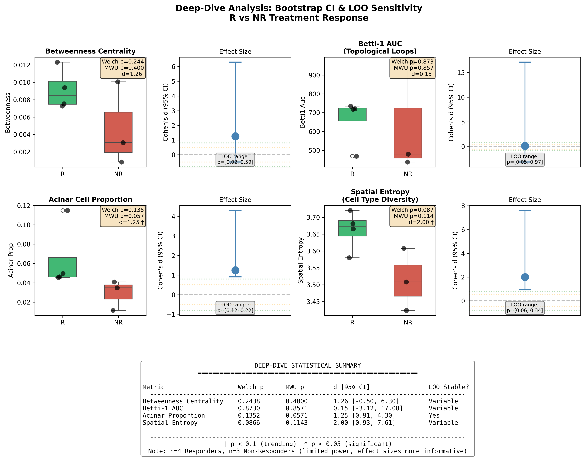
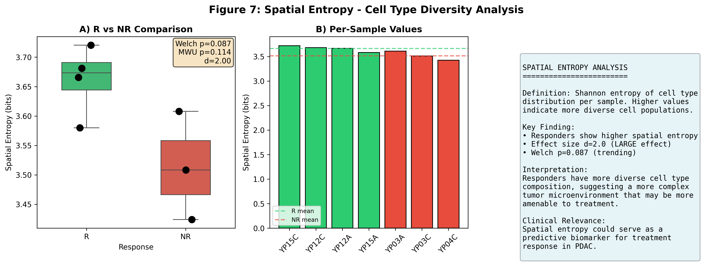
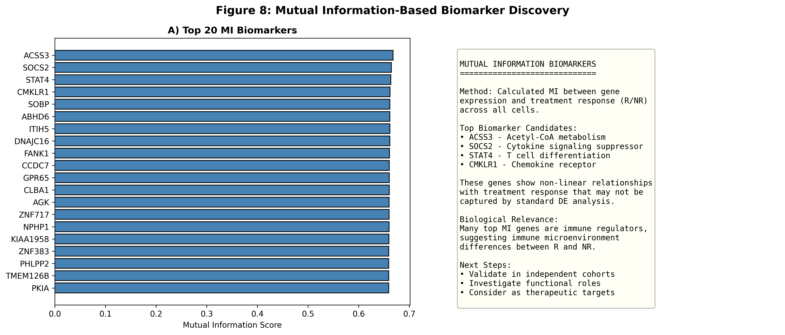

# Spatial Biology Hackathon 2026: PDAC Treatment Response

[](https://www.python.org/downloads/)
[](https://github.com/vanbelkummax/polymath-v4)
[](https://opensource.org/licenses/MIT)

**Cross-domain analysis of PDAC spatial transcriptomics to identify treatment response biomarkers.**

---

## H&E Tissue Overview

| Responder (YP12A) | Non-Responder (YP03A) |
|-------------------|----------------------|
|  |  |

---

## Dataset

| Group | Samples | Total Cells |
|-------|---------|-------------|
| **Responders (R)** | YP12A, YP12C, YP15A, YP15C | 5,195 |
| **Non-Responders (NR)** | YP03A, YP03C, YP04C | 3,730 |

*YP04A excluded: 134 cells after QC (below 500 threshold)*

---

## Key Findings (Day 4 Deep-Dive)

### Statistical Summary

| Metric | R | NR | Effect d | p-value | LOO Stable |
|--------|---|----|---------:|--------:|:----------:|
| **Spatial Entropy** | 3.66 | 3.51 | **2.00** | 0.087† | ✅ |
| **Acinar Proportion** | 6.4% | 2.9% | **1.25** | 0.057† | ✅ |
| Betweenness | 0.0091 | 0.0047 | 1.26 | 0.24 | ❌ |
| Betti-1 AUC | 661 | 629 | 0.15 | 0.87 | ❌ |

*† p < 0.1 (trending); Bootstrap CI (n=1000); LOO = Leave-One-Out sensitivity*

### Interpretation

1. **Spatial Entropy (d=2.0)**: Responders have higher cell type diversity → more complex TME
2. **Acinar Cells (d=1.25)**: Higher in responders → less dedifferentiated tumors
3. **Betweenness**: Large effect but unstable under LOO → needs validation

---

## Figure Gallery

### Sample Overview
*Spatial cell type distribution across all 7 samples*


### Deep-Dive Statistical Analysis
*Bootstrap CI and LOO sensitivity for key metrics*


### Spatial Entropy (Most Robust Finding)
*Cell type diversity comparison with dual stats*


### Acinar Cell Comparison
*Trending difference in exocrine cell proportion*


### MI Biomarkers
*Top genes by mutual information with response status*


### Summary Dashboard
*Comprehensive overview of all key findings*


---

## Methods

### Polymath-Driven Analysis

Cross-domain algorithms from the Polymath v4 knowledge base (50K algorithms):

| Algorithm | Origin | Application |
|-----------|--------|-------------|
| Betweenness Centrality | Graph Theory | Hub cell identification |
| Persistent Homology | Algebraic Topology | Tissue architecture |
| Mutual Information | Information Theory | Biomarker discovery |
| Shannon Entropy | Information Theory | Cell type diversity |

### Statistical Framework

- **Dual testing**: Welch's t-test + Mann-Whitney U
- **Bootstrap CI**: 1000 iterations for effect sizes
- **LOO sensitivity**: Stability under sample removal
- **FDR correction**: Benjamini-Hochberg for multiple testing

---

## Repository Structure

```
spatial-hackathon-2026-showcase/
├── figures/
│   ├── he/                    # H&E tissue images
│   ├── fig1_sample_overview   # Orientation
│   ├── fig_deepdive_analysis  # Key statistical analysis
│   ├── fig7_spatial_entropy   # Most robust finding
│   ├── fig8_summary_dashboard # Overview
│   └── fig11_acinar_comparison
├── tables/
│   ├── deep_dive_metrics.csv  # Raw metrics
│   └── deep_dive_stats.csv    # Full statistics
├── scripts/
│   └── statistical_framework.py
└── data/
    └── sample_metadata.csv
```

---

## Limitations

⚠️ **All findings are hypothesis-generating** (n=4 R, n=3 NR)

- Minimum achievable MWU p-value: 0.057
- Statistical power: 8-20% for moderate effects
- Validation required in n≥20 per group

---

## Citation

```
Van Belkum M. Spatial Biology Hackathon 2026: Cross-domain analysis of
PDAC treatment response using Polymath v4. January 2026.
```

## Contact

Max Van Belkum | MD-PhD Student | Vanderbilt University
